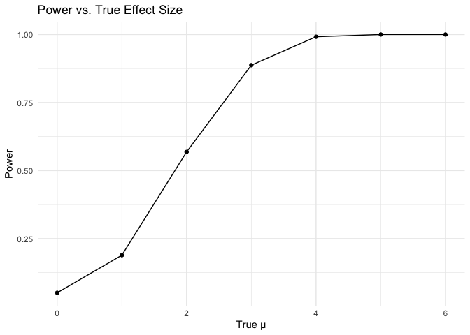
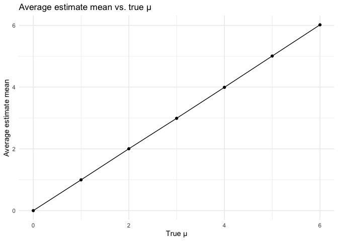
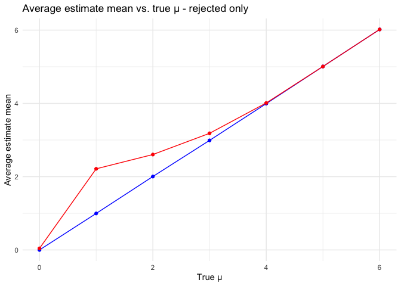

p8105_hw5_lc3807
================
Linshen Cai
2023-11-14

## Problem 3

``` r
n = 30
sigma = 5
alpha = 0.05

ttest = function(n,mean,sigma){
  sim_data = tibble(
    x = rnorm(n,mean = mean, sd = sigma)
  )
  
  tstats = broom::tidy(t.test(sim_data$x, mean = mean, conf.level = 0.95, mu = 0))
  mu_hat=tstats$estimate[1]
  p_value = tstats$p.value[1]
  
  results = tibble(mu_hat,p_value)
  results
}

generate_5000 = function(mean){
  output = list()
  for(i in 1:5000){
  output[[i]] = tibble(
    ttest(n,mean,sigma))
  }
sim_results = bind_rows(output) |> 
  mutate(mean = mean)
}
mu_0=generate_5000(0)
```

The mu_0 table contain all mu hats and p values of t test based on
random 5000 datasets when we set mean of population is 0.

``` r
mu_1=generate_5000(1)
mu_2=generate_5000(2)
mu_3=generate_5000(3)
mu_4=generate_5000(4)
mu_5=generate_5000(5)
mu_6=generate_5000(6)
```

``` r
mu_all = bind_rows(mu_0,mu_1,mu_2,mu_3,mu_4,mu_5,mu_6)

power = mu_all |> 
  group_by(mean) %>% 
  summarize(prop_rejected = sum(p_value < 0.05)/5000) 

plot_power = ggplot(power,aes(x = mean,y = prop_rejected)) +
  geom_point() +
  geom_line() +
  labs(title = "Power vs. True Effect Size",
       x = "True μ",
       y = "Power") +
  theme_minimal()

plot_power
```

<!-- -->

``` r
average_estimate_mean = mu_all |> 
  group_by(mean) |> 
  summarize(average_estimate = mean(mu_hat))

plot_compare = ggplot(average_estimate_mean,aes(x = mean,y = average_estimate)) +
  geom_point() +
  geom_line() +
  labs(x = "True μ",y = "Average estimate mean",title = "Average estimate mean vs. true μ") +
  theme_minimal()

plot_compare
```

<!-- -->

``` r
average_estimate_mean_rejected = mu_all |> 
  filter(p_value < 0.05) |> 
  group_by(mean) |> 
  summarize(average_estimate = mean(mu_hat))

ggplot() +
  geom_line(data = average_estimate_mean, aes(x = mean, y = average_estimate),color = "blue") +
  geom_point(data = average_estimate_mean, aes(x = mean, y = average_estimate),color = "blue") +
  geom_line(data = average_estimate_mean_rejected, aes(x = mean, y = average_estimate),color = "red") +
  geom_point(data = average_estimate_mean_rejected, aes(x = mean, y = average_estimate), color = "red") +
  labs(x = "True μ",y = "Average estimate mean",title = "Average estimate mean vs. true μ - rejected only") +
  theme_minimal() 
```

<!-- -->
\`\`\`
